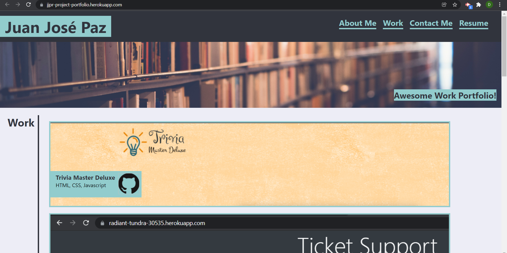
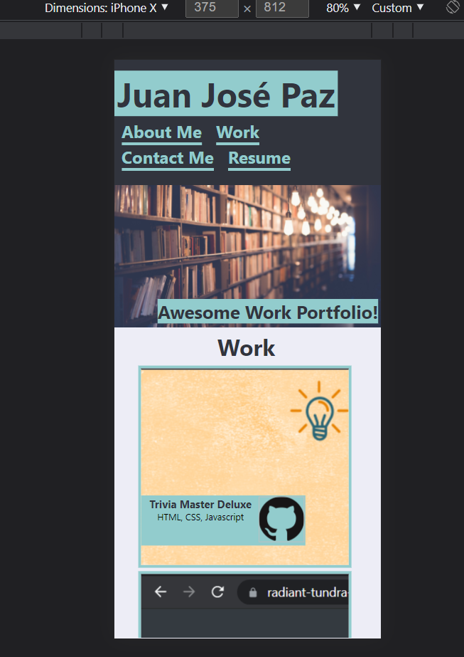

# Code Portfolio with REACT and Advanced CSS Code
According to the Challenge we had to code a website using our REACT and advanced CSS  knowledge learned in module 20 including mapping throught elements to dynamically generate components and to check user form input. Website is designed to act as a porfolio that will showcase our work. Website had to be responsive to multiple screen resolutions and adjust accordingly. 

### Check List
- [✓] Use React.
- [✓] Add HTML semantics.
- [✓] Structurized HTML logically.
- [✓] Use Flexbox to organize HTML elements.
- [✓] Check headings are in sequential order.
- [✓] Title of webpage is concise.
- [✓] Navigation links work.
- [✓] Section links send to the appropiate section.
- [✓] Most recent profile image
- [✓] Clickable image section to open develop apps.
- [✓] First Project images are the largest.
- [✓] Used media query to adjust website aspect in different screen sizes.
- [✓] Title of webpage is concise

### Compatible Screen Resolutions
1.  Desktop/Laptop Screens.
2.  Ipad Pro. (1024px)
3.  Ipad. (768px)
4.  Surface Duo. (540px)
5.  Iphone 6/7/8 Plus. (414px)
6.  Pixel 2/Pixel 2 XL. (411px)
7.  Iphone 6/7/8/X. (375px)
8.  Moto G4/ Galaxy S5. (360px)
9.  Iphone 5/SE. (320px)
10. Galaxy Fold. (280px)

For more details please see the code in [Portfolio repository](https://github.com/darkjuanjo/jjpr-professional_portfolio)

To see the webpage in brower please click the following link:  
[Juan Jose Paz Portfolio](https://jjpr-project-portfolio.herokuapp.com/)

**Below are PREVIEWS of 2 resolutions  with media query. **

## Portfolio web site preview

## Portfolio mobile site preview
